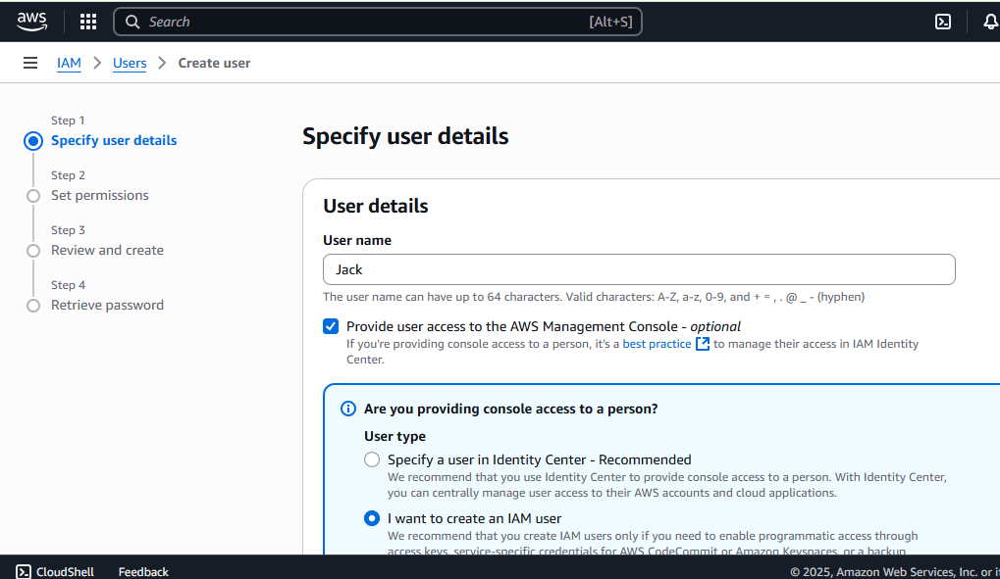

# gatogrowfast.com
GatoGrowFast.com is a Marketing  Consulting Company that uses AWS Identity and Access Management resources to grant access to its Staff.

This will be achieved in Two parts. In the first part of the practical, we'll create a policy granting full access to EC2. Then, we'll create a user named Eric and attach that policy to him.

In the second part, we'll create a group and add two more users, Jack and Ade, to that group. Afterward, we'll create a policy for granting full access to EC2 and S3, and attach it to the group.

Part-1

1. Navigate to the AWS Management Console using the search bar.

2. On the IAM dashboard, go to the left sidebar and click on 'Policies'.

a) Search for "EC2" and select "AmazonEC2FullAccess" from the list of policies.

b) Proceed by clicking on "Create policy" to initiate the policy creation process.

3. Now, select all EC2 actions.

4. Tick "All resources" and click "Next."

5. Now click on create policy

This is the policy we have created.

6. Now, proceed to the "Users" section, and select the option to "Create User."

7. Enter the desired username for the user.

a) Then select the option "Provide user access to the AWS Management Console" if access to the web-based console interface is required.

b) Proceed to set up a password for the user.

c) Check the box "Users must create a new password at next sign-in" if allowing users to change their password upon first sign-in is preferred.

8. Select "Attach policy directly" and navigate to "Filter customer managed policies."

a) Choose the policy you created named "policy_for_eric."

b) Then proceed by clicking "Next."

Note- Aws policies –
- Managed Policies: Made by AWS, used by many.
- Customer Managed Policies: You make and manage them.
- Inline Policies: Made for one specific thing.

For further details, please refer to Policies and permissions in IAM documentation

9. Next, click on "Create User."

10. Ensure to save these details securely for future reference.

a) Click on "Return to user list."

Eric's user has been successfully created, and the policy granting him full access to EC2.

Eric's user has been successfully created, and the policy granting him full access to EC2 has been attached.

Now let's come to Part-2

1. On the "User Groups" section, enter a name for the group.
   a) click on "Create User Group."

   b) Then, proceed to the "Users" section.

   This is the user you've created.

c) Now, let's proceed to the "Users" section.

2. Now, let's create a user named Jack.

3. In the "Permissions" options, select "Add user to group."
   a) Then, in the "User groups" section,
   b) choose the group you created named "development-team,"
   c) click "Next."

4. Now, click on create user

Lastly, let's create a user named Ade.

5. In the "Permissions" options, select "Add user to group."
   a) Then, in the "User groups" section,
   b) choose the group you created named "development-team,"
   c) click "Next."

6. Now, click on create user

7. Navigate to the "Policies" section and click on "Create Policy" to begin crafting a new policy.

8. Choose the two services, EC2 and S3, from the available options.

9. Enter the desired policy name and proceed to click on the "Create policy" button.

[EC2 & S3 Policy](image23.png)

10. Navigate to the "Users group" section and select the "Development-team" group.

9. Proceed to the "Permissions" section and add the necessary permissions.

10. Click on attach policy.

11. Select "Customer Managed Policy" as the policy type.
    a) Then choose the "development-policy" you created.
    b) click "Attach Policy."

b) click "Attach Policy."

The policy is now attached to the group, granting full permissions to EC2 and S3 for the group's users.

